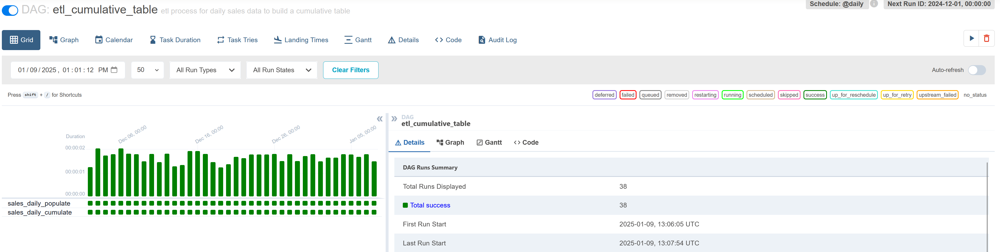
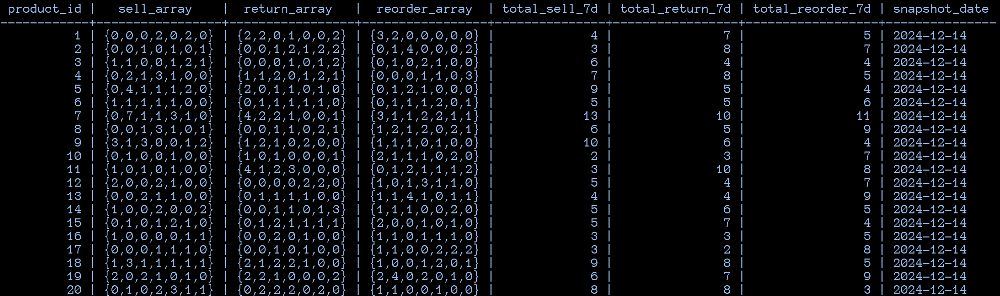

# ETL Cumulative Table
## Overview 🪟
This project serves as a Proof of Concept (PoC) for implementing an Extract, Transform, Load (ETL) process aimed at constructing a cumulative table with daily granularity. The source system uses mock data of sales events and upstreams them into a cumulative table of daily snapshots to analyze timeseries trends. This case study is ideal for understanding how data evolves in a time-based cumulative process and experimenting with technologies like PostgreSQL, Airflow and Docker. Feel free to explore, modify and play with the provided code.

Inspired by Zach Wilson's [cumulative-table-design](https://github.com/DataExpert-io/cumulative-table-design/).

## Table of Contents 🚩
1. [Constraints](#constraints-⚠️)
1. [Technology Stack](#technology-stack-📦)
1. [Prerequisites](#prerequisites-🚨)
1. [Installation](#installation-🛠️)
1. [Usage](#usage-💡)
1. [Results](#result-✅)
1. [Cleaning](#cleaning-🪥)
1. [Lessens Learned](#lessens-learned-🎓)
1. [Releases](#releases-🐣)
1. [License](#license-📃)

## Constraints ⚠️
This project **should not** be used in production environments. It contains several security flaws:
- Critical vulnerabilities in DockerHub images
- Use of default and exposed passwords
- Lack of in-transit encryption (no SSL/TLS)

Additionally, the system is not optimized for production use:
- Default configurations
- Airflow running in standalone mode

## Technology Stack 📦
**PostgreSQL** to store and transform the cumulative table.<br>
**Apache Airflow** for orchestrating and scheduling the ETL workflows.<br>
**Docker** deployment for simplicity and ease of setup.<br>

| Category           | Technology       | Version |
| :----------------- | :--------------- | :------ |
| DBMS               | PostgreSQL       | 16.3    |
| Orchestrator       | Airflow          | 2.8.2   |
| Infrastructure     | Docker Engine    | 27.4.0  |
|                    | Compose          | 2.31.0  |
| Tools              | psql             | 14.15   |
**Table 1:** Technology Stack

## Prerequisites 🚨
Shell program like bash or zsh.

Docker Engine is an open source containerization technology for building and containerizing your applications.

Compose simplifies the control of your entire application stack, making it easy to manage services, networks, and volumes in a single, comprehensible YAML configuration file. Then, with a single command, you create and start all the services from your configuration file.

Install Docker [Engine](https://docs.docker.com/engine/install/) and [Compose](https://docs.docker.com/compose/install/).

## Installation 🛠️
To install and use the pipeline, follow these steps:
1. Clone the repository:
    ```bash
    git clone https://github.com/axel-stage/etl-cumulative-table
    ```
1. Navigate to the project directory:
    ```bash
    cd etl-cumulative-table
    ```
1. Start the stack in detached mode:
    ```bash
    docker compose up -d
    ```
1. The database initialization takes around two minutes, mainly due to
the population of 1 million records mock sales events (first deployment only).

## Usage 💡
1. Launch the Airflow UI by opening a web browser and navigating to `http://localhost:8080`.
1. Authenticate using the credentials specified in the `airflow/.env` file (look for `USERNAME` and `PASSWORD`).
1. Select the DAG named `etl_cumulative_table` from the Airflow interface.
1. Initiate the DAG by toggling the activation switch.
1. The DAG will execute a backfill process to populate the cumulative table, starting from `2024-12-01` up to the current date.

1. Start an interactive shell session in the running container:
    ```bash
    docker exec -it database bin/bash
    ```
1. Connect to the local database server using the `psql` tool:
    ```bash
    psql --username=${DB_USER} --dbname=${DB_NAME}
    ```
1. Query the `daily_cumulate` table within the `sales` schema:
    ```bash
    select * from sales.daily_cumulate where snapshot_date = '2024-12-14';
    ```
    Use the arrow keys to navigate through the results, and press `q` to exit the table view.
1. Quit the `psql` session:
    ```bash
    \q
    ```
1. Terminate the interactive shell session:
    ```bash
    exit
    ```
1. Shut down the Docker Compose stack (containers only):
    ```bash
    docker compose down
    ```

## Results ✅
### Cumulative table excerpt

### Schema Structure
**product_id**: Identifier for a hypothetical product<br>
**sell_array**: Array containing daily sales data for the product, including the snapshot date and the preceding 6 days<br>
**return_array**: Array containing daily return data for the product, including the snapshot date and the preceding 6 days<br>
**reorder_array**: Array containing daily reorder data for the product, including the snapshot date and the preceding 6 days<br>
**total_sell_7d**: Aggregate of daily sales over the last 7 days (snapshot date inclusive)<br>
**total_return_7d**: Aggregate of daily returns over the last 7 days (snapshot date inclusive)<br>
**total_reorder_7d**: Aggregate of daily reorders over the last 7 days (snapshot date inclusive)<br>
**snapshot_date**: record date for the snapshot<br>

### Analytics
The presented upstream analytics serve as a preliminary demonstration of the system's capabilities. The rolling windowed metrics, aggregated KPIs and data granularity levels (e.g., daily, weekly, etc.) can be tailored to meet specific use case requirements. Additionally the data pipeline could be extended towards advanced analytics:

**Time Series Forecasting**<br>
Predict future sales, returns, and reorder demands using historical data.

**Anomaly Detection**<br>
Use machine learning models to detect unusual patterns (e.g., sudden spikes in returns or drops in sales).

## Cleaning 🪥
1. Remove container, networks, **volumes** and images defined in the Compose file:<br>
  **Be aware that the database will be deleted!**
  ```bash
  docker compose down --volumes --rmi local
  ```

## Lessens Learned 🎓
### Data Engineering
- Enhanced query efficiency due to incremental loads of daily limited records, avoiding full table scans and expensive **GROUP BY** operations
- Lowered infrastructure expenses due to reduced computational resource requirements for the workload
- Fully configurable process tailored for time-series analytics, allowing extensive customization
- Fully automated ETL (Extract, Transform, Load) pipeline
### PostgreSQL
- Array data type is very efficient to store and operate with running window data
- Useful NULL handling with COALESCE() function especially in FULL OUTER JOINS
- GENERATE_SERIES() and RANDOM() functions are great helpers to generate mock data
- Parametrize psql query execution with use of environment variables and /set feature
### Airflow
- Use SQLExecuteQueryOperator action operator to execute a SQL query against a PostgreSQL db
- Keep queries in its own file and import them into the DAG (exceptions are very short queries)
- Keep transformation logic in the query
- Parameterize queries with built-in Airflow variables
### Docker
- Simplicity of running a lightweight infrastructure via docker compose
- Automation of PostgreSQL database setup after container start

## Releases 🐣
- 0.1.0
    - First proper release
    - Working prototype

## License 📃
This project is licensed under the MIT license.
See [LICENSE](LICENSE) for more information.
